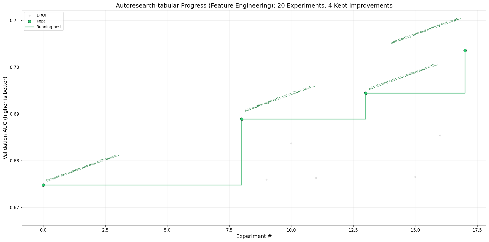

# autoresearch-tabular

`autoresearch-tabular` is a small fork of [Andrej Karpathy's `autoresearch`](https://github.com/karpathy/autoresearch), also inspired by [`autoresearch-glm`](https://github.com/ajzhanghk/autoresearch-glm/tree/master), and adapted for tabular feature engineering for a fixed XGBoost benchmark. The data is from a peer-to-peer lender and it includes credit and bureau information about the applicants.

The benchmark is now:

- binary classification only
- one prepared dataset only
- one fixed XGBoost training setup
- validation AUC as the main optimization target

The editable surface is feature engineering. This means trying compact derived features from the fixed tabular columns, such as ratios, interaction terms, and other hand-crafted combinations of credit, balance, payment, and inquiry signals. The goal is not to build a large feature factory, but to discover a small set of engineered features that improves validation AUC without making the benchmark hard to understand.



## How it works

- `prepare.py` loads the dataset.
- `train.py` runs either a plain baseline or the current tuned XGBoost policy.
- `program.md` defines the experiment loop for the agent.

The benchmark is intentionally narrow:

- binary classification
- tabular features only
- XGBoost only
- validation AUC as the primary metric

One run evaluates one current policy and this repo is not meant to be a general AutoML system or a multi-model framework. The point is to keep the code small enough so that the agent can rewrite the benchmark itself.

## Quick Start

Requirements:

- Python 3.10+
- the Prosper parquet file at the repo root

Prepare the cache:

```bash
python prepare.py
```

Run the required untuned baseline:

```bash
python train.py --baseline
```

Run the current tuned search policy:

```bash
python train.py
```

By default, both scripts now use the same cache location:

```text
~/.cache/autoresearch-tabular
```

If you want the cache inside the repo instead, set:

```bash
export AUTORESEARCH_TABULAR_CACHE=.cache/autoresearch-tabular
```

## Running the agent

Simply spin up your Claude, Codex, or whatever agent you want in this repo, then prompt something like:

```bash
Hi have a look at program.md and let's kick off a new experiment! 
```

The `program.md` file is essentially a super lightweight skill. It tells the agent what it can edit, what it should optimize, how to log experiments, and when to keep or revert a change.

The intended loop is:

1. `prepare.py` stays fixed.
2. The agent reads `program.md`.
3. The agent edits `train.py`.
4. The agent runs `python train.py`.
5. The agent keeps or discards the code change based on `val_auc`.

## Experiment Logging

Each experiment should produce:

- a raw log in `logs/<run-name>.log`
- a row in `results.tsv`

The main fields tracked are:

- `val_auc`
- `initial_val_auc`
- `test_auc`
- `oot_auc`
- `num_features`
- `class_balance`
- `status`
- `description`

## Philosophy

This repo is meant to stay simple.

Better validation AUC is the goal, but simpler code is preferred when performance is similar. Small improvements that add a lot of machinery are usually not worth keeping.
